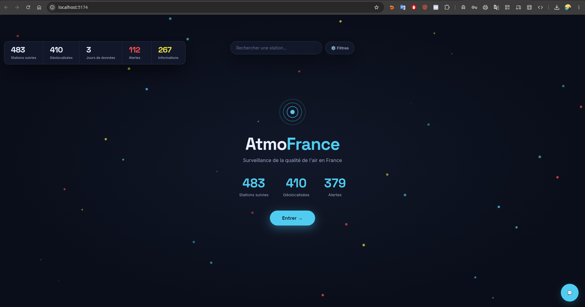

# AtmoFrance

Plateforme d'ingénierie de données pour la surveillance de la qualité de l'air en France.

Le système ingère les mesures des stations de surveillance nationales, les fiabilise, les enrichit de leur géolocalisation, calcule l'indice ATMO officiel et détecte les dépassements de seuils réglementaires. L'ensemble est exposé via une API REST et une application web cartographique interactive.

## Aperçu



## Problème traité

La pollution atmosphérique est la première cause environnementale de mortalité en Europe. Les données existent mais restent dispersées et peu exploitées en vue analytique. AtmoFrance construit une chaîne complète, de l'ingestion à la restitution, pour transformer ces mesures en information exploitable.

## Architecture

Architecture Lakehouse Médaillon (Bronze / Silver / Gold) combinant traitement en flux et en lot.

| Couche | Technologie | Rôle |
|--------|-------------|------|
| Ingestion streaming | Apache Kafka | Flux temps réel des mesures |
| Traitement distribué | Apache Spark | Nettoyage, enrichissement, agrégation |
| Datalake | MinIO (compatible S3) | Zones Bronze / Silver / Gold en Parquet |
| Stockage relationnel + géo | PostgreSQL + PostGIS | Indices Gold et référentiel géographique |
| Stockage NoSQL | MongoDB | Relevés bruts semi-structurés |
| Orchestration | Apache Airflow | Pipeline quotidien automatisé |
| API | FastAPI | Exposition des indices, stations et alertes |
| Restitution | React | Application web cartographique interactive |

Voir `docs/architecture.md` pour le détail.

## Fonctionnalités implémentées

- Ingestion en flux de ~31 000 mesures via Kafka
- Architecture médaillon Bronze / Silver / Gold sur MinIO (format Parquet, partitionné)
- Calcul de l'indice ATMO par station (6 polluants réglementés)
- Géolocalisation de 410 stations par croisement avec la Base Adresse Nationale
- Détection des dépassements de seuils (information et alerte)
- Orchestration quotidienne du pipeline via Airflow
- API REST documentée (FastAPI + Swagger)
- Application web React : carte interactive, tableau de bord analytique, assistant conversationnel, 8 langues
- Tests automatisés et intégration continue (GitHub Actions)

## Perspectives d'évolution

Ces axes constituent des extensions envisagées, non encore implémentées :

- **Prévision de la qualité de l'air à 24 h** par apprentissage automatique, en croisant l'historique des mesures avec des données météorologiques
- **Enrichissement météorologique** des mesures (le soleil et le vent conditionnent la formation des polluants)
- **Migration cloud** effective de la plateforme (les choix techniques, notamment le datalake compatible S3, la rendent immédiate)

## Stack technique

**Données** : PostgreSQL + PostGIS, MongoDB, MinIO
**Streaming & traitement** : Apache Kafka, Apache Spark
**Orchestration** : Apache Airflow
**API** : FastAPI
**Interface** : React, Leaflet, Recharts, i18next
**Infrastructure** : Docker, Docker Compose
**Qualité & CI** : pytest, ruff, GitHub Actions

## Démarrage rapide

### Prérequis
- Docker et Docker Compose
- Python 3.13
- Node.js 18+

### Lancement

```bash
# 1. Démarrer les services (bases, Kafka, MinIO)
docker compose up -d

# 2. Environnement Python
python -m venv .venv
source .venv/bin/activate
pip install -r requirements.txt   # ou : make install

# 3. Configurer les variables d'environnement
cp .env.example .env
# puis renseigner les valeurs dans .env

# 4. Lancer le pipeline (via Airflow, voir docs/)

# 5. Démarrer l'API
.venv/bin/python -m uvicorn api.main:app --port 8000

# 6. Démarrer l'interface web
cd interface
npm install
npm run dev
```

- API : `http://localhost:8000` (documentation interactive : `/docs`)
- Interface : `http://localhost:5173`

## Structure du projet

```
atmofrance/
├── api/            # API FastAPI (endpoints, requêtes)
├── ingestion/      # Producteurs et consommateurs Kafka
├── processing/     # Transformations Spark (Bronze -> Silver -> Gold)
├── infra/          # Configuration Airflow et infrastructure
├── tests/          # Tests unitaires
├── interface/      # Application web React
├── ml/             # Espace réservé aux modèles (perspective)
├── docs/           # Documentation et captures d'écran
├── scripts/        # Scripts utilitaires (démo, diagnostic)
├── docker-compose.yml
├── Makefile
└── README.md
```

## Tests et qualité

```bash
pytest tests/ -v      # tests unitaires
ruff check .          # analyse statique du code
```

## Contexte

Projet réalisé dans le cadre du Master 2 Data Engineering & Intelligence Artificielle (EFREI Paris), en vue de la validation du titre RNCP36739 « Expert en Ingénierie de Données ».

---

*Sources de données : Geod'Air (LCSQA), Base Adresse Nationale — Licence Ouverte.*
